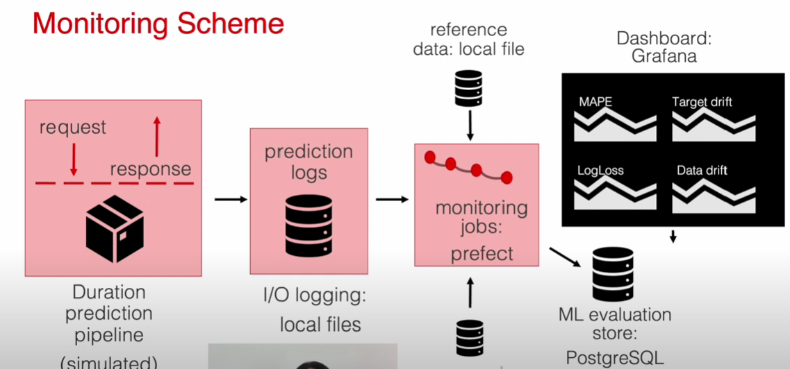

# ml service on production
there are many things to check when a ml model is deployed on production to maintain its performance.
- service health
- model performance
- data quality and integrity
- data and concept drift
- performance by segment
- model bias/ fairness
- outliers
- model explainability

#### model performance
use a set of metrics to evaluate the model performance (ranking metric, mae, rmse, log loss, precision/ recall,  etc).   
#### data quality and integrity
about missing values or error in data.
#### data and concept drift
compare data distribution on training set and new data when the model is on production.    
if it is different, can assume that the model will not perform as it did on training set.
#### performance by segment
if data is more diverse, can segment the data to train a model for each segment.
#### model bias/ fairness
data is sensitive such as animal data, healthcare data, financial data
#### outliers
if the segments from above have high error individually, can remove it from the training set or wait for review.

# Batch vs Online 
how to monitor the model performance on production?    
* add ml metric to service health monitoring
    - Prometheus: pull ml metrics from production service
    - Grafana: visualize the metrics
* build an ml-focused dashboard 
    - visualisation tools such as Grafana, Tableau, PowerBI, Looker

### Batch
#### Data Quality
Compare data distribution between reference (training set?) and current batch data    

### Non-Batch
#### Data Quality
create a window function to compare data distribution for each window

#### monitoring scheme
<a>
  
</a>


## requirements.txt explanation
- prefect for monitoring
- tqdm for progressive bar
- requests for load data from internet
- joblib for saving and loading python objects
- evidently: Evidently is an open-source Python library for data scientists and ML engineers. It helps evaluate, test, and monitor the performance of ML models from validation to production. It works with tabular, text data and embeddings

## Docker-compose
* never build docker compose ```docker-compose up --build```     
